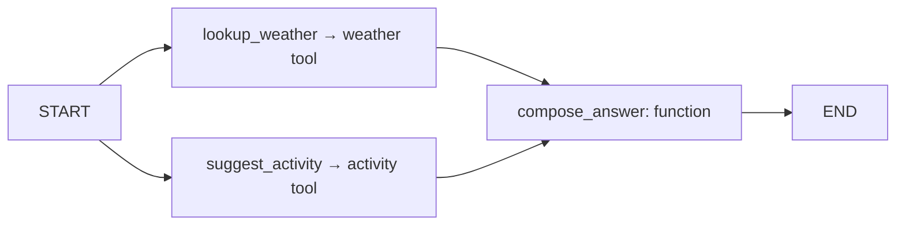

# LangGraph + Datool

[langgraph_weather.py](./langgraph_weather.py) runs a real LangGraph `StateGraph`
with parallel weather/activity nodes and a final answer node. Passing Datool's
`CallbackHandler` through `config={"callbacks": [handler]}` automatically captures
the graph and its nodes, including the nested LangChain weather/activity tools.
There are no Datool decorators or manual observation wrappers in the example.

Weather values and answer formatting are deterministic. No model-provider API
key, model request, or invented token/cost data is used.



## Run from the repository root

```sh
export DATOOL_BASE_URL="https://your-datool-host"
export DATOOL_PROJECT_ID="your-project-id"
export DATOOL_API_KEY="your-organization-key"

uv run --project packages/python-sdk --group langgraph python \
  packages/python-sdk/examples/langgraph_weather.py --mode sync
```

Use an organization key with `traces:write`. The SDK is installed from this
checkout; LangGraph is an optional development/example dependency. The SDK offers
an optional `langchain` extra for the callback integration (`langchain-core`);
base SDK installs do not require LangChain. The lockfile pins LangGraph 1.2.12.

Other execution modes:

The async modes mix synchronous tool nodes with a native coroutine answer node.

```sh
uv run --project packages/python-sdk --group langgraph python \
  packages/python-sdk/examples/langgraph_weather.py --mode async --city London

uv run --project packages/python-sdk --group langgraph python \
  packages/python-sdk/examples/langgraph_weather.py --mode stream

uv run --project packages/python-sdk --group langgraph python \
  packages/python-sdk/examples/langgraph_weather.py --mode async-stream
```

The script prints the persisted Datool trace ID and the graph's final state:

```json
{
  "trace_id": "<generated trace ID>",
  "result": {
    "city": "São Paulo",
    "temperature": 22,
    "activity": "visit a park",
    "answer": "São Paulo: 22°C; visit a park."
  }
}
```

In Datool, look for the `langgraph-weather` trace. Its three node spans are
`lookup_weather`, `suggest_activity`, and `compose_answer` (functions). The first
two contain `lookup-weather` and `suggest-activity` tool spans. Each node records
its input state and returned update; tools record their arguments and result.
The root records the final merged state. The script waits for PostgreSQL
persistence before printing success. Streaming modes consume graph state
snapshots; these are LangGraph state updates, not model token streams.

To use this in your own graph:

```python
from datool import get_client
from datool.langchain import CallbackHandler

datool = get_client()
handler = CallbackHandler()
result = graph.invoke(inputs, config={"callbacks": [handler]})
datool.flush()
print(handler.last_trace_id)
```

Use the same config for `ainvoke`, `stream`, or `astream`. Consume or explicitly
close streams, then flush. Model calls made through LangChain are automatically
captured as generations, including model names and usage when the provider supplies
them. A handler may be reused, but `last_trace_id` is only useful sequentially;
use a separate handler per concurrent invocation when you need its final trace ID.

## ReAct agents and Deep Agents

[react_agent.py](./react_agent.py) runs a real model → weather tool → model loop.
It uses LangChain's current `create_agent` by default. `--legacy` uses LangGraph's
`create_react_agent`, which emits its upstream deprecation warning.

[deep_agent.py](./deep_agent.py) uses `create_deep_agent` with `TodoListMiddleware`
and a `weather-expert` subagent. It writes a plan, delegates with `task`, invokes
the specialist's weather tool, completes the plan, and returns an answer. Its
`StateBackend` keeps agent files in memory. Only the parent invocation receives
Datool's callback; the framework propagates it into the specialist.

```sh
uv run --project packages/python-sdk --python 3.12 --group agents python \
  packages/python-sdk/examples/react_agent.py --mode async

uv run --project packages/python-sdk --group agents python \
  packages/python-sdk/examples/react_agent.py --legacy --mode stream

uv run --project packages/python-sdk --python 3.12 --group agents python \
  packages/python-sdk/examples/deep_agent.py --mode async-stream
```

Both accept all four execution modes on Python 3.11+. Deep Agents requires Python
3.11+. On Python 3.10, use `--legacy` for async modes: the tested modern `create_agent`
implementation drops model callbacks in its async path. Modern sync/stream modes
and all legacy ReAct modes work on Python 3.10. The CLI rejects the unsupported
modern async combination. The optional `agents` development group pins LangChain
1.4.2 and Deep Agents 0.7.18 without adding them to the SDK's runtime dependencies.

The [shared demo helper](./datool_agent_demo.py) supplies a deterministic chat model
and invokes the agents with `config={"callbacks": [CallbackHandler(client=client)]}`.
It uses each library's actual agent/tool implementation. The offline model consumes
no provider tokens and records no fabricated usage or price.

To run a real provider instead, install its integration and pass `--model`:

```sh
# Requires OPENAI_API_KEY and makes billable provider requests.
uv run --project packages/python-sdk --group agents --with langchain-openai python \
  packages/python-sdk/examples/react_agent.py --model openai:gpt-4.1-mini
```

The same option works for `deep_agent.py` and supplies the model to its specialist.
Use `create_agent` for new ReAct code, as described in the
[LangGraph migration guide](https://docs.langchain.com/oss/python/migrate/langgraph-v1).

## Verification

```sh
uv run --project packages/python-sdk --group langgraph --group agents pytest packages/python-sdk/tests/test_langgraph.py packages/python-sdk/tests/test_agents.py
bun run test:python:integration
```

The tests cover sync/async invocation and streaming, concurrent handlers, nested
graphs/tools/models, cancellation, redaction, and errors. The persistence test
installs a wheel into a clean environment and runs actual Datool API handlers,
Redis, the ingestion worker, and disposable PostgreSQL. It checks 13 graph runs,
including the example CLI and a deterministic LangChain model fixture. It also
checks ReAct and Deep Agent invocations, their standalone CLIs, planning updates,
delegated-tool ancestry, and model failures. SQL assertions verify saved parent
relationships, messages, model usage, and failure states.
No production data or paid model endpoint is used by these tests.

The graph construction follows the [official LangGraph graph API](https://docs.langchain.com/oss/python/langgraph/graph-api).
